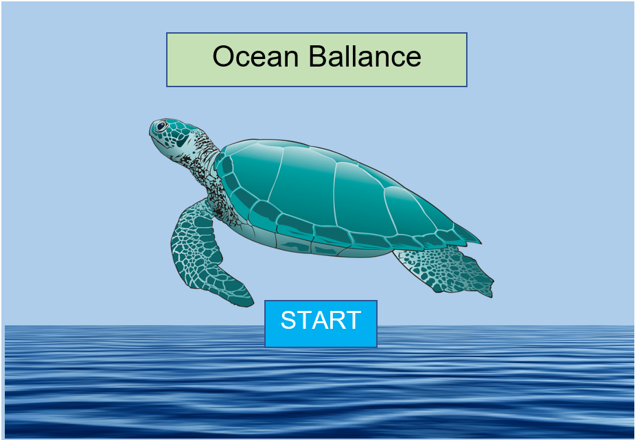
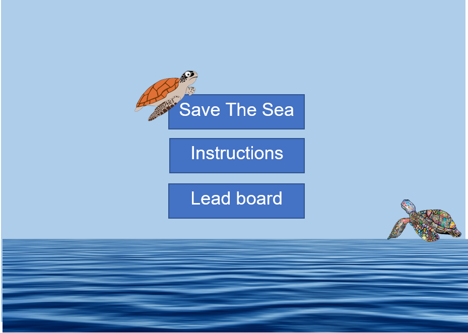
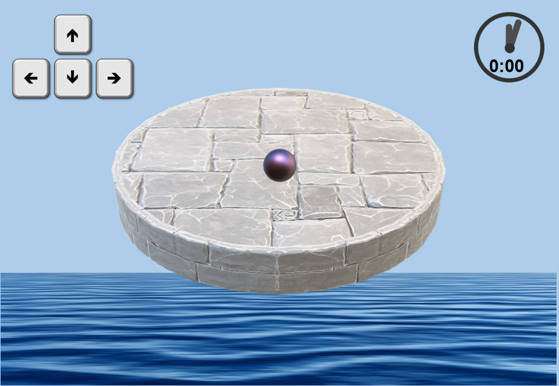
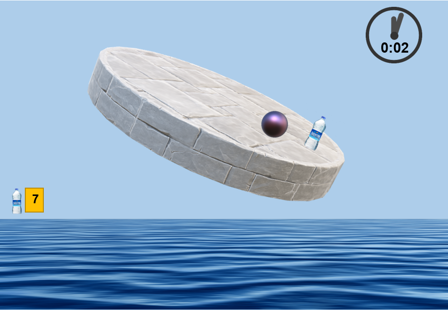
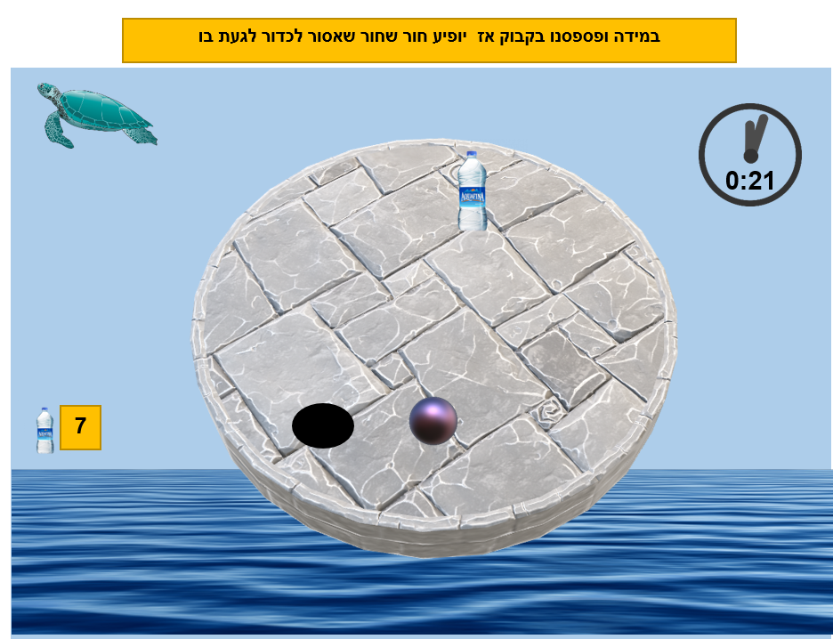
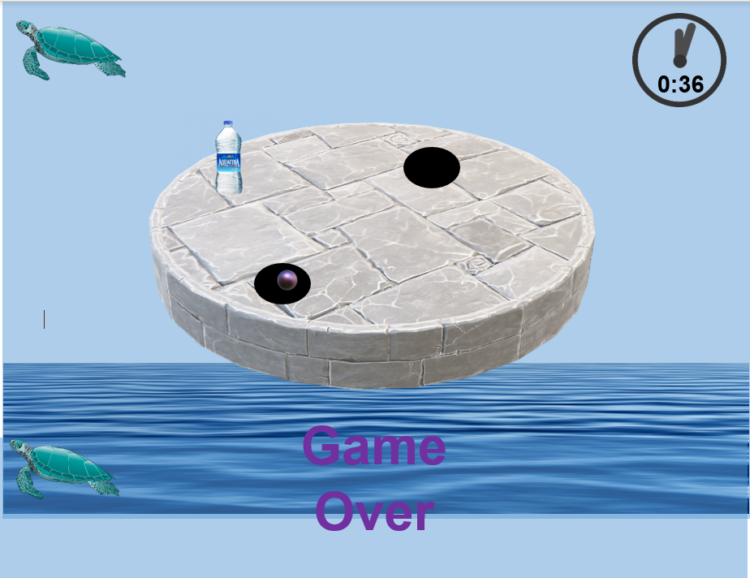
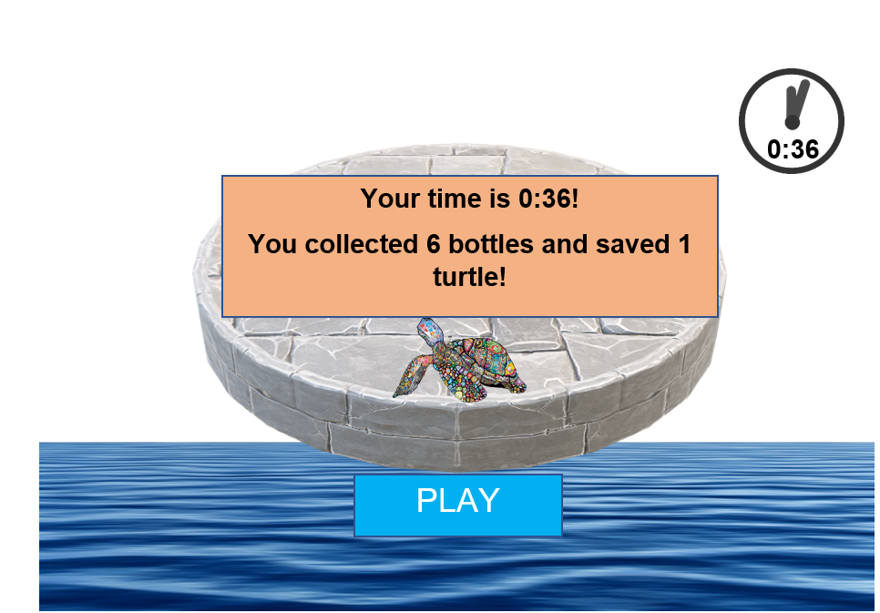

# FinalProject-OceanBalance
Balance game for final project
OceanBalance
tagline: תיאור המשחק במשפט אחד קצר וקליט
A game that test your bakance ability.

מהות המשחק
תארו את הרעיון המרכזי של המשחק שלכם (concept) בשלושה-ארבעה משפטים - "נאום מעלית".

העולם שלנו מתחיל להיהרס !
דרושה פעולה מיידית של כל אחד מאיתנו !
המשחק הזה מהנה בטירוף, תחרותי, כיפי ומשפר ביצועים מוטוריים עדינים אך עם זאת, מחביא בתוכנו מטרה עילאית והיא הטמעת עניין שמירת העולם וקיימות, בדרך צעירה כיפית ומשחקית.
אתה גם משחק גם שובר שיאים וגם מרגיש שאתה מציל את העולם 
אז  let's Balance the Ocean

איזה סוג משחק זה, ולמי הוא מיועד?

המשחק הוא תחרותי ולכן קהל היעד של המשחק הוא כל אדם שאוהב משחקים קוויקים ממכרים כאשר הרמה עולה מרגע לרגע בנוסף המשחק הוא תחרותי אישי ומי שאוהב לשבור שיאים של עצמו לבחון את יכולותיו יהנה מאוד מהמשחק הזה.
המשחק גם מדבר אל חובבי הטבע שרוצים לשמור על החיות ולהפיץ מודעות חיובית בנושא

לאיזה פלטפורמה (כגון: מחשב רגיל / טלפון נייד / אינטרנט)?

המשחק מתאים גם למחשב וגם לטלפון נייד.
בטלפון נייד היתרון הוא שימוש באיזון הבנוי הקיים במכשיר הטלפוני, עוד במחשב התזוזה תהיה ע"י החיצים.

לאילו שחקנים (איזה גילים / רמת כישרון / רמת ניסיון / תחומי עניין)?

.המשחק דורש מוטרוקיה עדינה וכל אדם בעל יכולות פיזיות תקינות יכול לשחק במשחק זה. 
לכן המשחק מיועד לגילאי 7+ בגיל זה היכולות המוטוריות יחסית טובות ויכולות להתפתח תוך כדי המשחק עצמו.
בנוסף בעלי חיבה לחיות ואיכות הסביבה ימצאו הנאה רבה במטרה המשנית של המשחק שהיא העלאת המודעות לאיכות הסביבה ושמירה על העולם.

לכמה שחקנים (אחד / רבים, שיתופי / תחרותי)?

המשחק מיועד לשחקן יחיד

פרטי המשחק
1. מה רואים?
איך נראה מסך המשחק?
מה רואים בגבולות של המסך?
האם אפשר לעבור את גבולות המסך?
מה רואים מעבר לגבולות המסך?
הוסיפו ציורי מסך.

2. מה עושים?
איך דברים קורים? איך מתקדמים במשחק?

תהליך ההתחלה של המשחק - שלושים השניות הראשונות;
תהליך הליבה של המשחק – רצף-הפעולות שהשחקן מבצע שוב ושוב על-מנת להתקדם במשחק;
תהליך הסיום של המשחק – הפעולות שהשחקן מבצע כדי לנצח / לסיים את המשחק.
מה המטרות שהשחקן צריך להשיג כדי לנצח במשחק?
לגבי כל תהליך, תארו את המכניקה שלו - באיזה פקדים השחקן ישתמש (עכבר / מקלדת / מגע), ומה יקרה במשחק כתוצאה מכך.

הוסיפו תרשימים הממחישים את התהליכים השונים.

מסך הפתיחה

לאחר מכן

המשחק עצמו

לאחר אי אסיפת "פריט פלסטיק"

סיום המשחק

3. מה העצמים?
מה הם האובייקטים במשחק ומה הם עושים? האם כל אחד מהאובייקטים הוא:

עצם חיוני לצורך השגת היעדים (main quest object)?
עצם לא-חיוני אבל מסייע לשחקן (משאב)?
עצם נייטרלי?
עצם המפריע לשחקן (מכשול)?
הוסיפו תרשימים של העצמים השונים.

4. מה האפשרויות?
אילו בחירות השחקן יכול לעשות כדי לשנות את צורת המשחק? בפרט:

אילו רמות-קושי יהיו במשחק? מה יהיו ההבדלים בין רמות-קושי שונות?
אילו סוגי-שחקנים יהיו במשחק?
אילו אפשרויות יהיו למאפיינים החיצוניים של המשחק? (בהירות, קול וכו')
הוסיפו תרשים של מסך בחירת האפשרויות.

5. מה העולם?
באיזה עולם מתרחש המשחק? באיזו סביבה?
האם העולם יהיה סגור או פתוח? עגול או שטוח?
מה הם חוקי הפיסיקה, הטבע, הגיאוגרפיה, ההסטוריה, הכלכלה, החברה והפוליטיקה בעולם שלכם?
איזה חוקים יגבילו את פעולות השחקן במשחק?
לפי איזה חוקים ייקבעו תוצאות של פעולות במשחק?
הוסיפו מפות ותרשימים של העולם.

6. מה הסיפור?
מהו סיפור הרקע של המשחק – מה קרה לפני שהמשחק התחיל?
מהי עלילת המשחק - מה קורה במהלך המשחק ואיך השחקן משפיע על העלילה?
הוסיפו תרשים המתאר את הקשת הדרמטית.

7. מי הדמויות?
מה התכונות שלהן, מה התפקיד שלהן במשחק, ואיך הן ייראו?
דמויות מרכזיות - מי יהיה ה"גיבור" ומי ה"מתנגד" העיקרי?
דמויות משניות – מי הן יהיו, ומה כל אחת תוסיף לחוויית השחקן?
הוסיפו תרשימים של הדמויות.

שלבים במשחק
תארו לפחות N+1 שלבים שונים שיהיו במשחק. הסבירו את המבנה של כל שלב ואת ההבדלים ביניהם.

סקר שוק
לפני שמתחילים לעבוד על משחק (או כל מוצר אחר), חשוב לוודא שלא עשו את זה קודם. לא נעים לעבוד סמסטר שלם (או שנה שלמה) על משחק ואז לגלות שכבר יש משחק כזה.

חפשו בגוגל, בחנות play, בפייסבוק, ובכל מקום אחר שיש לכם גישה אליו, משחקים דומים לרעיון שלכם. ציינו באיזה ביטויי-חיפוש השתמשתם.

זהו את שלושת המשחקים הדומים ביותר. לגבי כל אחד מהם:

שימו קישור וצילום-מסך להמחשה.
הסבירו מה תעשו כדי שהמשחק שלכם יהיה שונה/מקורי/מיוחד/טוב יותר מהמתחרים? מדוע שחקנים יעדיפו דווקא את המשחק שלכם?
